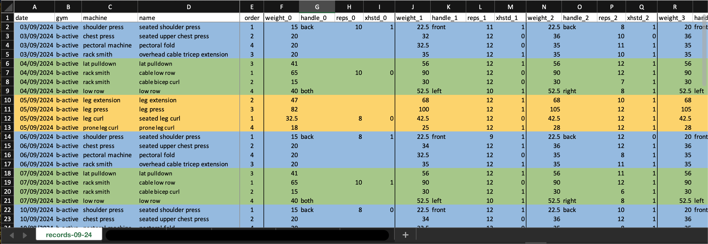
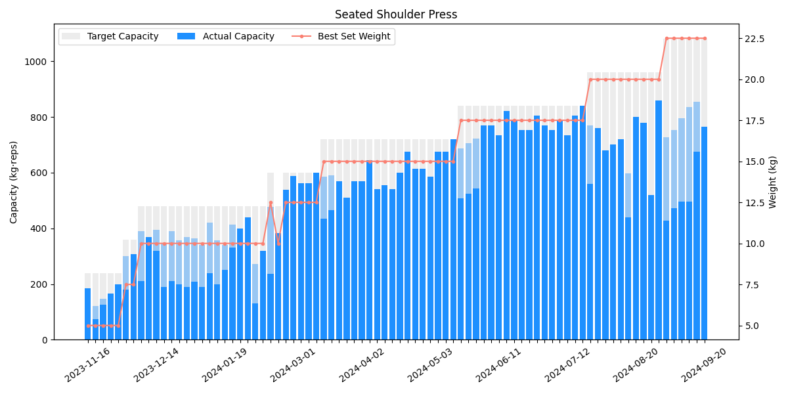

# Gym Track Visualizer (GViz)

Welcome to GymTrackVisualizer (GViz), a project designed to help you **analyze** and **visualize** your workout data. Whether you want to compute how often you go to the gym, see trends in your training weights, or evaluate your workout capacity, GViz makes it simple and insightful.

## Installation

To get started with GViz, follow the steps below to clone the repository and install GViz from source as well as all necessary packages.

* Clone the Repository
```bash
git clone https://github.com/cabinz/gym-track-visualizer.git
```

* Install GViz
```bash
# Change directory to the project folder
cd gym-track-visualizer

# Install the package
pip install .
```

## Usage

### Recording Your Workout Data

1. **Create an Excel File**: Start with a new or existing Excel file.
2. **Sheet Naming**: Rename the sheet name to start with "records".
3. **Columns**: Include all required columns as shown in the sample.

Using Excel’s [Card Views](https://support.microsoft.com/en-us/office/use-cards-view-to-work-with-table-data-on-your-phone-fda6099e-2de8-4a52-a926-90a7ee61a32b), you can conveniently record your performance during your gym sessions. Sync the file with cloud services like OneDrive or iCloud to update from your mobile phone.

Example Sheet:



*Note*: By default, `gviz.loader.Loader` will load all sheets with names starting with "records". Customize sheet loading using the `sheet_names` argument in the `Loader()` initializer.

### Loading Data

To load data from your Excel file, use the following code:

```python
from gviz import Loader

DATA_FILE = "path/to/excel/file.xlsx"
loader = Loader(data_file=DATA_FILE)
df = loader.get_records()

print(df.head())
```

### Statistical Analysis

Leverage GViz for comprehensive statistical analysis of your workout data:

```python
import gviz
from gviz.common import *

full_rec = loader.get_records(start_date='2023-11-01', end_date='2024-09-20')
first_day, last_day = full_rec[COL_DATE].min().date(), full_rec[COL_DATE].max().date()
duration_days = (last_day - first_day).days + 1
active_days = get_num_active_days(full_rec)
active_hrs = active_days * 1.5

print(f'Duration: {first_day} ~ {last_day} ({duration_days}d)')
print(f'Workout days: {active_days}d')
print(f'Workout day percentage: {active_days / duration_days:.2%}')
print(f'Accumulated workout hours: {active_hrs}h')

# >>> Output >>>
# Duration: 2023-11-15 ~ 2024-09-20 (311d)
# Workout days: 204d
# Workout day percentage: 65.59%
# Accumulated workout hours: 306.0h
```

### Visualization

Visualize your training progress with GViz:

```python
import matplotlib.pyplot as plt
import gviz

item_name = 'seated shoulder press'
groups = df.groupby(gviz.COL_ITEM_NAME)
item_df = groups.get_group(item_name)

fig, ax = plt.subplots(figsize=(12, 6))
fig = gviz.draw(
    # For detail drawing config, read the API docstring
    item_df, ax, 
    title=item_name,
    legend_outside=False,
)
plt.show()
```

Visualization Example:



## Contributing
You want to contribute to the project? Welcome!

Since this is an open source project, we would love to have your feedback! If you are interested, we would also love to have your help! Whether helpful examples to add to the docs, or FAQ entries, everything helps.